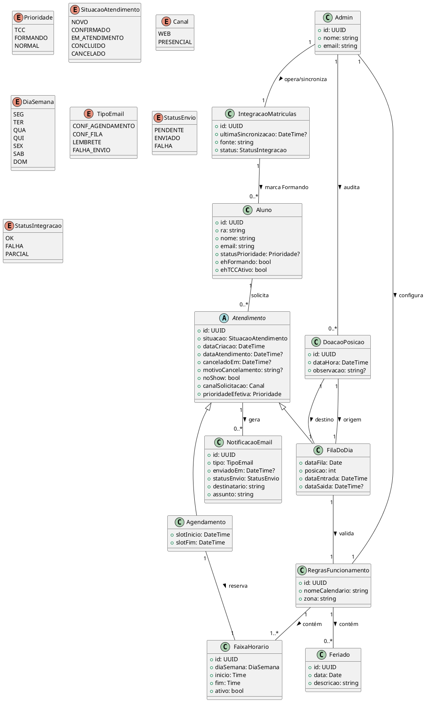

## 1. Visão Geral do Domínio
O sistema permite que **Alunos** solicitem **Atendimentos** por
**Agendamento** (slot de horário) ou **Fila do Dia** (entrada com posição). Há
**prioridades** (TCC, Formando), **Regras de Funcionamento**
(expediente/feriados) e **Notificações** por e-mail. A **Administração** configura
horários, sincroniza a lista de **Formandos** via o **Sistema de Matrículas** e
encerra o dia (reset da fila).
---
## 2. Diagrama de Classes (PlantUML)

